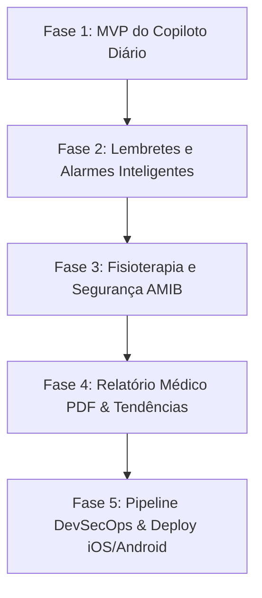

# 🗺️ Roteiro de Desenvolvimento: AsmaControl Pro

> **Missão:** Construir um copiloto móvel confiável, inteligente e offline-first para o manejo diário, prevenção de crises, adesão terapêutica e reabilitação respiratória pediátrica.

---

## 🧭 Papéis no Projeto
- **Você (Product Owner & Arquiteto DevSecOps):** Define as regras de usabilidade da rotina real, prioridades da família e validações de segurança/privacidade.
- **Antigravity (Tech Lead & Desenvolvedor Fullstack Flutter):** Desenvolve 100% do código Dart/Flutter, telas, banco de dados, motores de cálculo clínico e pipelines de build.

---

## 🎯 Fases de Desenvolvimento

---

### 🟢 FASE 1: O "MVP do Copiloto Diário" (Uso Imediato no Bolso)
*Objetivo: Permitir que pai e mãe registrem o estado da criança em menos de 30 segundos e recebam feedback clínico imediato.*

1. **Perfil da Criança:**
   - Nome, data de nascimento (5 anos), peso, altura e Melhor PFE Pessoal (Personal Best).
   - Lista de medicações ativas (Preventivas: ex. Clenil/Budesonida/Symbicort vs Resgate: Aerolin/Salbutamol).
2. **Registro Diário Rápido (Diário Clínico):**
   - Entrada de Peak Flow (3 sopros com detecção de erro de técnica > 20 L/min).
   - Sinais vitais rápidos: SpO2 (%) e Frequência Respiratória.
   - Sinais visuais de esforço (Tiragem intercostal, batimento de asa de nariz, tosse noturna).
3. **Motor de Alertas em Tempo Real:**
   - 🟢 **Verde:** Asma estável.
   - 🟡 **Amarela:** Alerta precoce de descompensação (orientação de resgate).
   - 🔴 **Vermelha:** Crise severa com botão de rota de emergência para o Pronto-Socorro.
4. **Higiene Pós-Corticoide:**
   - Lembrete visual imediato pós-spray para bochecho/escovação (prevenção de candidíase/sapinho).

---

### 🟡 FASE 2: Lembretes Inteligentes e Monitoramento de Resgate
*Objetivo: Nenhuma dose preventiva esquecida e acompanhamento ativo após uso de bombinha de resgate.*

1. **Alarmes Locais de Medicação Contínua:**
   - Notificações sonoras e visuais para as doses da manhã e da noite.
2. **Loop de Reavaliação Pós-Resgate (Protocolo de 20 Minutos):**
   - Quando uma dose de resgate (SABA) é registrada na Zona Amarela, o app agenda um alarme automático para **20 minutos depois**:
   - *"Como está a respiração agora? Vamos medir o Peak Flow / Saturação novamente?"*
   - Detecta precocemente se a crise está cedendo ou se a criança está evoluindo para a Zona Vermelha.

---

### 🔵 FASE 3: Módulo de Fisioterapia e Segurança AMIB
*Objetivo: Proporcionar segurança máxima durante sessões de cinesioterapia respiratória e exercícios domiciliares.*

1. **Checklist Pré-Exercício com Trava Automática:**
   - Bloqueio se SpO2 < 88% ou frequência respiratória excessiva.
2. **Guia de Níveis AMIB (1 a 5):**
   - Sugestão de exercícios apropriados para o nível de estabilidade da criança.
3. **Questionário Gamificado c-ACT (Mensal):**
   - Formulário com carinhas ilustrativas para a criança responder + 3 perguntas para os pais, calculando o score de controle mensal.

---

### 🟣 FASE 4: Relatório Médico para Pediatra/Pneumologista (PDF com 1 Clique)
*Objetivo: Acabar com o "esqueci como foi o mês" na consulta médica.*

1. **Exportação de Prontuário em PDF Diagramado:**
   - Gráfico de linha com a evolução do Peak Flow dos últimos 30/60 dias.
   - Contagem exata de quantas vezes a bombinha de resgate foi necessária.
   - Histórico de crises, saturação média e evolução do escore c-ACT.
2. **Rastreamento de Laudos LME (Farmácia Cidadã SUS / Alto Custo):**
   - Avisos automáticos de expiração de espirometria e laudos médicos.

---

### 🔒 FASE 5: DevSecOps, Criptografia e Publicação
*Objetivo: Automatizar builds, garantir privacidade absoluta (LGPD/CFM) e instalar no iPhone e Android da família.*

1. **Segurança e Criptografia:**
   - Persistência local criptografada (AES-256 no dispositivo).
   - Sincronização segura via Firebase com as regras imutáveis (`firestore.rules`).
2. **Pipeline CI/CD (GitHub Actions):**
   - Execução automática de testes unitários e linter a cada `git push`.
   - Geração automática de APK (Android) e build para iOS (TestFlight / IPA).
